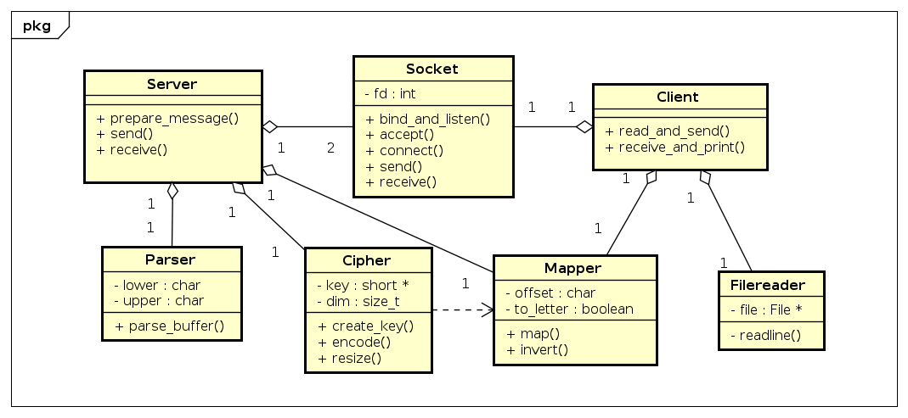

# TP1: Hill Cipher
- Nombre: Leonardo Giampieri Mutti
- Padron: 102358
- URL: https://github.com/leogm99/tp1

## Introduccion

En el siguiente trabajo, se desarrollaron 2 programas que emulan el cripto Hill Cipher. Un *cliente*, que lee un archivo linea por linea y se las envia a un *servidor*, el cual se encarga de encriptar lo recibido y devolverlo al cliente.
En este informe se mostrará el diseño de ambos programas y algunas complicaciones que presentaron.
La idea de este trabajo es aplicar buenas practicas de programacion en el desarrollo de tipos de datos abstractos en C, encapsulamiento y manejo de sockets y strings, y el correcto uso y liberacion de recursos (memoria, file descriptors).

## Ejecucion

Se muestra como se pueden ejecutar los programas en la shell.

`./server <PORT> <KEY>`

`./client <HOST> <PORT> <FILE>` o `echo -e <TEXT> | ./client <HOST> <PORT> -`

La restriccion que hay sobre la KEY es que esta puede tener 4, 9 o 16 caracteres, caso contrario, el servidor no levantará. Los puertos deben estar disponibles. Cabe destacar que primero debe levantarse el servidor para poder encriptar nuestro archivo. A medida que el servidor encripte las lineas del archivo, estas serán devueltas al cliente y este las mostrará por `stdout`.

## Diseño

Se muestran a continuacion *diagramas de "clases"* (estrictamente, no existen las clases en C, pero es una forma de pensar a los TDA's!) de ambos programas. Cabe destacar que este no incluye el comportamiento entero de las clases, mas bien es una vista de alto nivel de las relaciones que hay y sus metodos mas importantes.

Se puede notar que `Socket` encapsula todo lo que corresponde a la comunicacion entre `Servidor` y `Cliente`, mientras que estos se encargan de preparar los mensajes y de enviarlos de la manera que pide el enunciado. `Mapper` y `Parser` no se conocen entre si, y sirven para separar incumbencias. Cada módulo está pensado y construido de manera de subdividir los problemas que se presentan en el trabajo, leer de un archivo (`Filereader`), parsear la lectura (`Parser`), mapear a numeros o a texto (`Mapper`), cifrar los mensajes (`Cipher`), enviarlos y recibirlos (`Server` y `Client`) y establecer la interfaz que permite enviar y/o recibir (`Socket`). El servidor y el cliente lo que necesitan conocer es estas interfaces para poder darles uso, no tanto sus detalles de implementacion.

## Problemas

- Cipher: Hubieron algunos inconvenientes en cuanto al diseño de este TDA. Al trabajar con arreglos de caracteres, cabía la posibilidad de que haya un desbordamiento al realizar la multiplicacion "matriz/vector", por eso mismo se optó por convertir los arreglos de caracteres a arreglos de tipo `short`, de modo tal de asegurarse que no haya mayores problemas. Esta conversion luego llevo a que se tenga que recastear el arreglo a `char` de modo tal de poder enviarle al cliente el cifrado respetando el protocolo. También, puede llegar a resultar complicado interpretar cómo es que se realiza la multiplicación "matriz/vector", ya que se aprovecha de aritmetica modular y del hecho de que los arreglos representan cada uno a cosas diferentes, en un caso una matriz, y en el otro un arreglo de vectores. La linea especifica en al que sucede todo esto es: `new_buf[i + (j / self->dim)] += aux[i + (j % self->dim)] * self->key[j]`.
- Parser/Mapper: Al inicio del desarrollo, no se tenia muy aclarado si estos iban a ser dos modulos separados o si podrian ir en un mismo modulo. Para esto ultimo se habria utilizado un arreglo constante de caracteres posibles ("A...Z"), para el cual se buscaria en este si uno de los caracteres leidos estaba, devolviendo un puntero, y a este restandole la base del arreglo, de modo que el mappeo y parseo seria un 2x1. Se decidio ahorrarse ese arreglo en memoria e ir por una version un poco humanamente inteligible.
- Server/Client: Son TDAs considerablemente mas verbosos que el resto, utilizan las interfaces del resto de los tdas para poder preparar sus mensajes, enviarlos y recibirlos. Se pensó utilizar otro tda de menor nivel para poder encapsular ciertos comportamientos, pero al final se decidió ir a una version de "menor nivel" para evitar, capaz, un tda innecesario.
- Filereader: En principio, se pensó que para la lectura de archivos en general, se podria tener un arreglo en el stack, con un tamaño estatico. Al ver los casos de prueba, se llego a la conclusion de que los tamaños eran muy variables, y que ademas luego habria que parsear los caracteres invalidos, por lo cual tener arreglos en memoria seria muy engorroso y complicado de mantener (ademas de ser dificil su extension), de modo tal que se prefirio usar una funcion como `getline` que nos permite reservar el tamaño del buffer de lo leido en memoria.
- General: Se realizaron varios cambios por el hecho de que no se sabia si algunos objetos podrian recidir en el stack o en el heap. Por ejemplo, la key del servidor, la cual en solo podia tener 3 valores posibles, se considero y opto por almacenarla en un buffer de tamaño fijo. Esta decision no es arbitraria ya que el problema tiene como precondicion de que los tamaños validos serian estos. Si se piensa en terminos de perdidas, serian a lo sumo 12 bytes "malgastados". En cambio, para todo el trabajo del parseo, cifrado, se necesitó usar el heap, ya que no se sabe el tamaño de las lineas, ni cuanto van a ocupar luego de estar parseadas, y se podria llegar a desperdiciar mucha memoria (ademas de que quedaria mas desprolijo el codigo).
